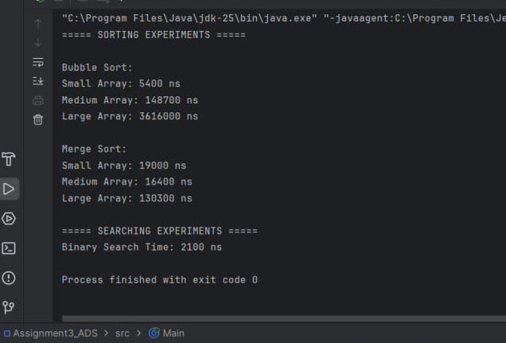
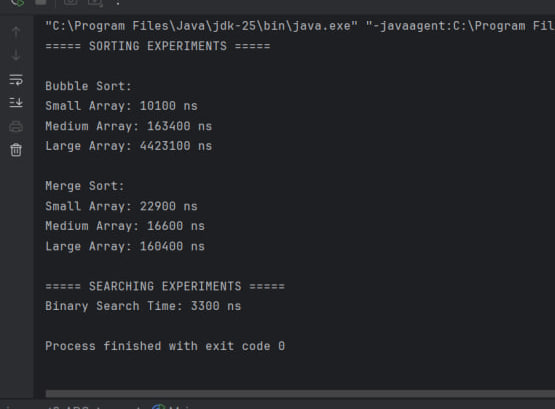
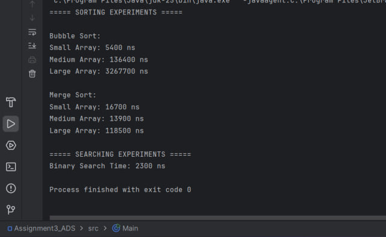
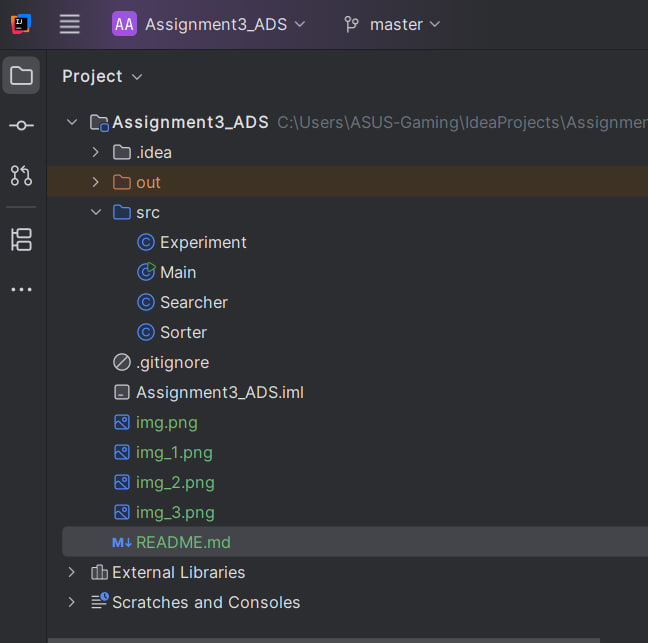

# Assignment 3 – Sorting and Searching Algorithm Analysis System

## Student Information

Name: Yerali Karkinbayev

Course: Algorithms and Data Structures  
University: Astana IT University (AITU)

---

# A. Project Overview

In this project, I implemented and compared different sorting and searching algorithms in Java.

Algorithms used:
- Bubble Sort
- Merge Sort
- Binary Search

The purpose of the project was to compare algorithm performance on arrays of different sizes and measure execution time using System.nanoTime().

---

# B. Algorithm Descriptions

## Bubble Sort
Bubble Sort compares neighboring elements and swaps them if they are in the wrong order.

### Time Complexity
- Best: O(n)
- Average: O(n²)
- Worst: O(n²)

---

## Merge Sort
Merge Sort divides the array into smaller parts, sorts them recursively, and merges them back together.

### Time Complexity
- Best: O(n log n)
- Average: O(n log n)
- Worst: O(n log n)

---

## Binary Search
Binary Search searches for an element in a sorted array by checking the middle element.

### Time Complexity
- Best: O(1)
- Average: O(log n)
- Worst: O(log n)

---

# C. Experimental Results

The program was tested on:
- Small arrays (10)
- Medium arrays (100)
- Large arrays (1000)

## Example Results

| Algorithm | Small | Medium | Large |
|---|---|---|---|
| Bubble Sort | 6500 ns | 172500 ns | 4076500 ns |
| Merge Sort | 16600 ns | 15100 ns | 179400 ns |

Binary Search Time: 2900 ns

---

## Analysis

Merge Sort was much faster than Bubble Sort, especially on large arrays.

Bubble Sort becomes slower because it uses nested loops. Merge Sort works more efficiently using divide-and-conquer.

Binary Search was very fast because it removes half of the search space after every step.

The practical results were close to theoretical Big-O complexity.

---

# D. Screenshots

## Program Output

---

# E. Reflection

This assignment helped me better understand sorting and searching algorithms in practice.

Bubble Sort was easy to implement but slow for large arrays. Merge Sort was harder because of recursion, but much faster.

I also learned how to measure execution time using System.nanoTime().

---

# Technologies Used

- Java
- IntelliJ IDEA
- GitHub

---

# Repository Structure

---

# Conclusion

This project demonstrated the difference between simple and advanced algorithms and showed how algorithm complexity affects performance.